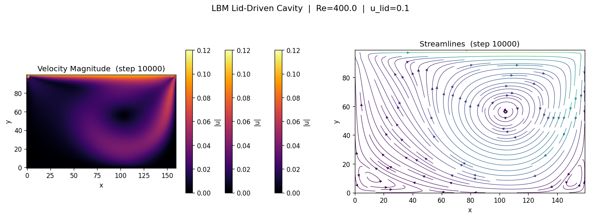

# LBM Fluid Simulation

格子ボルツマン法 (Lattice Boltzmann Method) を用いた2次元流体シミュレーション

---

## 概要 / Overview

本プロジェクトは **D2Q9 格子ボルツマン法 (LBM)** によるリッド駆動キャビティ流れ (Lid-Driven Cavity Flow) の数値シミュレーションです。

- **衝突モデル**: BGK（Bhatnagar–Gross–Krook）単一緩和時間
- **境界条件**: 半ウェイバウンスバック（固定壁）、Zou–He 速度境界条件（移動蓋）
- **可視化**: 速度マグニチュードのヒートマップ + 流線図

### シミュレーション設定

| 壁 | 条件 |
|---|---|
| 上壁（蓋） | 一定速度 `u_lid` で右方向に移動 |
| 下・左・右壁 | 静止（ノースリップ） |

### デモ画像 / Demo



*Re = 400, 160×100 グリッド, 10,000 ステップ後の速度場と流線*

---

## 理論背景 / Theory

### 格子ボルツマン法

格子ボルツマン法は、流体をメゾスコピックなスケールで記述する計算手法です。
格子上の粒子分布関数 `f_i(x, t)` の時間発展を次式で追跡します。

```
f_i(x + e_i Δt, t + Δt) = f_i(x, t) - [f_i(x,t) - f_i^eq(x,t)] / τ
```

### D2Q9 モデル

2次元9速度 (D2Q9) モデルを使用します。9方向の格子速度は:

```
e_6  e_2  e_5
e_3  e_0  e_1
e_7  e_4  e_8
```

### 平衡分布関数

```
f_i^eq = w_i ρ [1 + 3(e_i·u) + 9/2(e_i·u)² - 3/2 u²]
```

### 無次元パラメータ

```
レイノルズ数:  Re = u_lid × Ny / ν
動粘性係数:    ν = (τ - 0.5) / 3
```

---

## セットアップ / Setup

### 必要環境

- Python 3.8 以上
- pip

### インストール

```bash
pip install -r requirements.txt
```

---

## 実行方法 / Usage

### 基本実行

```bash
python lbm_simulation.py
```

デフォルトでは `output/` ディレクトリに各ステップのスナップショット画像を保存します。

### オプション一覧

```
usage: lbm_simulation.py [-h] [--Nx NX] [--Ny NY] [--Re RE]
                         [--u_lid U_LID] [--steps STEPS]
                         [--interval INTERVAL] [--output OUTPUT]
                         [--animate]

オプション:
  --Nx NX            格子幅 (デフォルト: 200)
  --Ny NY            格子高さ (デフォルト: 100)
  --Re RE            レイノルズ数 (デフォルト: 400)
  --u_lid U_LID      蓋速度 [格子単位] (デフォルト: 0.1)
  --steps STEPS      タイムステップ数 (デフォルト: 20000)
  --interval INTERVAL スナップショット保存間隔 (デフォルト: 1000)
  --output OUTPUT    出力ディレクトリ (デフォルト: output)
  --animate          ライブアニメーション表示 (ディスプレイが必要)
```

### 実行例

```bash
# 低レイノルズ数 (Re=100) の安定した流れ
python lbm_simulation.py --Re 100 --steps 10000

# 高解像度シミュレーション
python lbm_simulation.py --Nx 300 --Ny 200 --Re 400 --steps 30000

# ライブアニメーション付き
python lbm_simulation.py --animate
```

### 安定性の目安

| パラメータ | 目安 |
|---|---|
| τ (緩和時間) | 0.5 より大きく設定 |
| u_lid | << 1 (格子単位) を推奨 |
| Ma 数 | `u_lid / (1/√3)` < 0.3 が望ましい |

---

## ファイル構成 / File Structure

```
LBMFluidSimulation/
├── lbm_simulation.py   # メインシミュレーションコード
├── requirements.txt    # Python パッケージ依存
├── docs/
│   └── demo.png        # デモ画像
└── output/             # シミュレーション出力 (実行時に生成)
```

---

## アルゴリズム / Algorithm

各タイムステップの処理順序:

1. **Zou–He 境界条件** — 移動蓋 (y = Ny-1) の未知分布関数を設定
2. **マクロスコピック量の計算** — 密度 ρ と速度 u を計算
3. **BGK 衝突** — `f* = f - (f - f^eq) / τ`
4. **ストリーミング** — 各方向に分布関数を伝播
5. **バウンスバック** — 固定壁での境界条件を適用 (衝突後の値を使用)

---

## 参考文献 / References

- Krüger, T. et al. *The Lattice Boltzmann Method: Principles and Practice*. Springer, 2017.
- Zou, Q. & He, X. "On pressure and velocity boundary conditions for the lattice Boltzmann BGK model." *Physics of Fluids*, 9(6), 1997.
- Ghia, U. et al. "High-Re solutions for incompressible flow using the Navier-Stokes equations and a multigrid method." *Journal of Computational Physics*, 48(3), 1982.

---

## ライセンス / License

MIT License